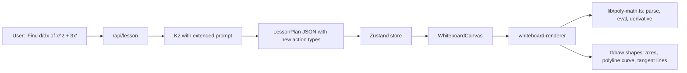

# Plan: Derivative Lesson with Graph Visualization

## Overview

Add a derivative-problem use case to the AI Whiteboard Tutor. K2 produces a multi-step lesson that derives the symbolic answer (e.g. d/dx[x²] = 2x) and the whiteboard renderer visualizes it by plotting the function on axes and drawing static tangent-line snapshots at chosen x-values to show that slope = f'(x).

## Locked design decisions

- **Tangent visualization:** static snapshots at K2-chosen x-values (no per-frame sweep animation). Reuses the existing per-action delay + per-step narration clock.
- **Function scope:** polynomials only, **degree ≤ 4**. No external math library.
- **Routing:** single unified K2 prompt — the model decides algebra vs. derivative path based on the problem text.

## Approach

K2 keeps its job: produce a `LessonPlan` of `Step`s with `narration` and `drawActions`. The renderer keeps its job: turn declarative actions into tldraw shapes. We add **four new high-level draw actions** that handle the math-heavy parts (graph, tangent) so K2 never has to emit hundreds of tiny line segments. A small in-house polynomial evaluator does the numeric work — no new dependencies.

### Data flow



### Why static tangents

Each tangent at a chosen x-value becomes its own `drawAction` (or its own `Step`). The existing per-action `defaultActionDelayMs = 550` and per-step narration clock in [lib/use-step-narration.ts](lib/use-step-narration.ts) already give us the "appear one after another" feel for free — no per-frame animation loop needed in the renderer.

### Action ordering requirement

The `axes` action rebuilds `axesMap[semanticLabel]` on every replay, so `plot_function` / `tangent_line` / `point` actions referencing that label must appear **after** the corresponding `axes` action — either in a later step, or later in the same step's `drawActions` array. The renderer processes actions in array order within a step, and the per-step rebuild replays earlier steps before the current one, so as long as the K2 prompt enforces ordering we get the transform map "for free" on every rebuild. If the order is violated the dependent action hits an empty `axesMap` entry and pushes a warning (same pattern as the existing `Highlight ... could not find target ...` path).

## New draw actions (extend the Zod union in [lib/tutor-core.ts](lib/tutor-core.ts))

All four go into the existing `drawActionSchema` union. Every action carries the standard `id`, `type`, `semanticLabel`, optional `description`.

- **`axes`** — coordinate system. Fields: `x, y, width, height` (screen-px plot box), `xMin, xMax, yMin, yMax` (math-domain), optional `xLabel, yLabel`. Renderer draws two axis lines at math-zero (or at the plot-box edge if zero is out of range), tick marks at integer values, and axis labels. Stores an `AxesTransform` (math→screen mapping) in a new `axesMap` on `RenderContext`.

- **`plot_function`** — polyline of y = f(x). Fields: `axesLabel`, `expression` (polynomial string like `"x^2 + 3x - 1"`), optional `xMin/xMax` (defaults to axes range), optional `samples` (default 80), optional `color` (default black). Renderer parses the expression, samples N points, maps to screen, emits a single tldraw `line` shape whose `props.points` is an N-entry map `{a1..aN}`. Do **not** mutate the existing `createLineShape` — it's hardcoded to two endpoints for the `create_shape` line kind and has other callers. Add a sibling `createPolylineShape(label, points: {x,y}[])` helper used only by `applyPlotFunctionAction`.

- **`tangent_line`** — single tangent at x=a. Fields: `axesLabel`, `expression`, `x` (math-domain), optional `length` (math-domain, default 4), optional `color` (default red). Renderer computes `y0 = f(a)` and `m = f'(a)` via the polynomial evaluator, draws a line from `(a - L/2, y0 - m·L/2)` to `(a + L/2, y0 + m·L/2)`, mapped to screen.

- **`point`** — small marker dot with optional label, used to mark the tangent contact `(a, f(a))`. Fields: `axesLabel`, `expression`, `x`, optional `label`. Renderer makes a tiny filled ellipse + a text shape.

The four new schemas are added to `drawActionSchema` and documented in the K2 prompt. Miss either side and you get the validation/silent-drop pattern noted in CLAUDE.md.

## New file: [lib/poly-math.ts](lib/poly-math.ts)

A ~60-line module with no deps. **Hard assumption: polynomial degree ≤ 4.**

- `MAX_DEGREE = 4` exported constant.
- `parsePolynomial(expr: string): { coeffs: number[] }` — coeffs indexed by power, length ≤ 5. Strips spaces, normalizes `-` to `+ -`, splits on `+`, filters empty tokens (handles leading `-`), matches each term against `^([+-]?\d*\.?\d*)\*?(x(?:\^(\d+))?)?$`. Throws `Error` on unparseable input **or if any term's power exceeds `MAX_DEGREE`** so the renderer can push a warning instead of crashing. Accepted token shapes must be enumerated in a leading comment and covered by inline assertions (not just the regex) so error messages are clear:
  - bare constants: `3`, `-1`, `0.5`, `.5`
  - implicit-coeff `x` (→ 1) or `-x` (→ -1)
  - explicit coeff with `x`: `3x`, `-2x`, `0.5x`
  - powers: `x^2`, `-x^3`, `2x^4`
  - optional `*`: `3*x^2`
  - empty token after split (leading minus case) must be silently dropped, not error.
- `evaluatePolynomial(p, x): number` — straight power-rule sum: `coeffs.reduce((sum, c, i) => sum + c * x ** i, 0)`. Plenty fast for the degree ≤ 4 polynomials we'll see, and reads exactly like the rule the tutor is teaching.
- `derivativePolynomial(p): { coeffs: number[] }` — `coeffs[i] = (i+1) * p.coeffs[i+1]`.

Used by the renderer for `plot_function` (sample y) and `tangent_line` (slope = `evaluatePolynomial(derivativePolynomial(p), a)`).

## Renderer changes ([lib/whiteboard-renderer.ts](lib/whiteboard-renderer.ts))

- Extend `RenderContext` with `axesMap: Record<string, AxesTransform>` where `AxesTransform = { toScreenX(mx): number; toScreenY(my): number; xMin; xMax; yMin; yMax; box: {x,y,w,h} }`. Built once per `axes` action; consumed by the three other new actions. Lives only in `RenderContext` (not surfaced in `WhiteboardRenderResult`) — the per-step rebuild model already replays `axes` actions before the dependent ones, so the map is reconstructed on every replay automatically. Don't try to diff (per CLAUDE.md).
- Add `applyAxesAction` — emits axis lines + tick marks + axis-label texts via the existing `createLineShape` / `createTextShape` helpers, then writes the transform to `axesMap`. **Shape-ID vs LabelMap separation (per CLAUDE.md's collision warning):** tldraw shape IDs must be globally unique, so each sub-shape needs its own derived ID (e.g. `createShapeId(\`${semanticLabel}__xaxis\`)`, `...__xtick_${i}`, `...__ylabel`), **but** every one of those shape IDs gets appended into `labelMap[semanticLabel]` via `appendLabel` so a single `erase` targeting the axes' `semanticLabel` clears the whole coord system. Same pattern applies to any other new action that emits more than one shape.
- Add `applyPlotFunctionAction` — looks up `axesMap[axesLabel]`, samples the polynomial, builds a points map `{a1..aN}` and creates a tldraw `line` shape (generalize `createLineShape` to accept an array of math points instead of just two endpoints).
- Add `applyTangentLineAction` and `applyPointAction` similarly.
- Extend the `applyAction` switch with the four new cases.
- If `axesLabel` doesn't resolve or the expression fails to parse, push a warning (same pattern as the existing `Highlight ... could not find target ...` path) and continue.
- **Coord range: do not widen by default.** The plan's default axes box (`x:120 y:80 width:420 height:260`) already fits inside the existing `x∈[120, 560], y∈[80, 340]` constraint, so no prompt-range change is needed for the MVP. If a concrete case fails, widen conservatively to `x∈[100, 580], y∈[70, 360]` and update both the instruction text *and* the example in [lib/k2-lesson-service.ts:81-86](lib/k2-lesson-service.ts#L81-L86) — not just the example.

## K2 prompt changes ([lib/k2-lesson-service.ts](lib/k2-lesson-service.ts))

In `buildK2Prompt`, extend the "Allowed draw action types" list with the four new ones and their required fields. Then add a calculus-specific recipe block (kept inline so the single prompt handles both algebra and calculus):

```
If the problem is a derivative (d/dx, "differentiate", "find the derivative"):
- The function MUST be a polynomial in x with integer or simple decimal coefficients
  and every power must be a non-negative integer <= 4. No sin/cos/exp/ln/sqrt/division-by-x.
  If the user's problem violates this, fall back to an algebra-style explanation without axes/plot.
- Step 1: write the function f(x) as text and state the goal.
- Step 2: state the rule being applied (power rule: d/dx[x^n] = n*x^(n-1)).
- Step 3: apply the rule term by term, using text + arrow actions.
- Step 4: state the symbolic derivative f'(x).
- Step 5: create an "axes" action sized roughly x:120 y:80 width:420 height:260
  with xMin=-4 xMax=4 yMin=-4 yMax=8 (adjust to the function's range).
- Step 6: plot_function for the original f(x) using the same axes.
- Step 7+: 2-3 tangent_line actions at well-chosen x values (e.g. x=-1, 0, 2),
  each preceded by a point action marking the contact point and a text
  annotation showing the slope value f'(x) at that point.
- Action ordering: the axes action MUST appear before any plot_function,
  tangent_line, or point action that references its semanticLabel — either
  in an earlier step, or earlier in the same step's drawActions array.
  Out-of-order references will push a warning and the shape won't render.
```

Keep the existing algebra guidance untouched — K2 routes itself based on the problem text.

## Wiring touchpoints (small)

- [components/whiteboard-tutor-shell.tsx](components/whiteboard-tutor-shell.tsx): update the textarea placeholder to hint at calculus too (e.g. `"Type a math problem... e.g. 2x + 3 = 11 or d/dx of x^2 + 3x"`). No structural change.
- No store/UI/API-route changes. The lesson plan shape is unchanged at the top level — only the action union grew, and Zod handles forward-compat fine.

## Risks & mitigations

- **K2 invents an unsupported expression** (e.g. `sin(x)`, `x^7`): polynomial parser throws (either un-tokenizable or degree > 4) → renderer pushes warning, the curve simply doesn't draw, the rest of the lesson still plays. The prompt explicitly restricts to polynomials with integer powers ≤ 4.
- **Tangent length too long pokes outside the plot box**: acceptable — the line just visually exits the axes. Renderer doesn't clip; we keep it simple.
- **Axes ticks at non-integer ranges look ugly**: clamp tick step to `Math.max(1, Math.round((xMax-xMin)/8))` so we always get a sane number of ticks.
- **K2 chooses a y-range that hides the curve**: the prompt gives a default range; for harder cases we could add a future "auto-fit" by sampling the curve and adjusting axes after the fact, but that's out of scope here.
- **Per-step rebuild cost grows**: still fine — even a 6-step lesson with 80-sample polylines is well under a frame.

## Out of scope (explicitly)

- Animated sweeping tangent (chose static).
- Non-polynomial functions / mathjs dependency (chose polynomials only).
- Topic classifier or UI toggle (chose single unified prompt).
- Integral / limit visualizations.
- Plotting f'(x) alongside f(x) — easy follow-up since `plot_function` + `derivativePolynomial` already exist, but not required for this feature.

## Implementation todos

1. **schema** — Add `axes`, `plot_function`, `tangent_line`, `point` Zod schemas to the `drawActionSchema` union in [lib/tutor-core.ts](lib/tutor-core.ts).
2. **polymath** — Create [lib/poly-math.ts](lib/poly-math.ts) with `parsePolynomial`, `evaluatePolynomial`, `derivativePolynomial` (no deps, degree ≤ 4 enforced).
3. **renderer-axes** — Extend `RenderContext` with `axesMap` and add `applyAxesAction` (axis lines, ticks, labels) in [lib/whiteboard-renderer.ts](lib/whiteboard-renderer.ts).
4. **renderer-plot** — Generalize `createLineShape` to accept N points and add `applyPlotFunctionAction` (polyline curve).
5. **renderer-tangent** — Add `applyTangentLineAction` (uses `derivativePolynomial` for slope) and `applyPointAction` (marker dot + optional label).
6. **renderer-switch** — Wire all four new cases into the `applyAction` switch with warning fallbacks for missing axes / unparseable expressions.
7. **k2-prompt** — Update `buildK2Prompt` in [lib/k2-lesson-service.ts](lib/k2-lesson-service.ts): document the 4 new action types, add the derivative-problem recipe block, widen the allowed coord range when axes are used.
8. **shell-hint** — Update the textarea placeholder in [components/whiteboard-tutor-shell.tsx](components/whiteboard-tutor-shell.tsx) to mention derivatives as an example.
9. **smoke-test** — Manually verify:
   - `"Find d/dx of x^2 + 3x"` — axes + curve + ≥2 tangents render; narration sequences via `audio.ended`.
   - `"Find d/dx of -x^2 + 2x"` — negative-leading-coefficient parser path (catches empty-token-after-normalization bug).
   - `"Find d/dx of sin(x)"` — K2 should fall back to algebra-style text explanation; if K2 ignores the guard, renderer pushes a warning and the rest of the lesson still plays.
   - Step-back via `currentStepIndex` — confirm `axesMap` rebuilds cleanly on full replay.
   - A single `erase` targeting the axes' `semanticLabel` clears all ticks + labels + axis lines (validates the shape-ID-vs-LabelMap separation).
10. **claude-md** — Add the four new action types to the `DrawAction model` section in [CLAUDE.md](CLAUDE.md) so future extensions don't miss them.
